# Thesis Methodology: Federated Learning Simulation Flowchart

This document details the step-by-step pipeline of the Federated TinyML LoRaWAN path loss regression simulation. The flowchart is structured in three horizontal phases to replicate the exact model fitting pipeline architecture used in the supervisor's primary reference paper (*Obiri & Van Laerhoven, EURASIP J. Wirel. Commun. Netw. 2026:66*).

---

## 1. Complete Simulation Flowchart (Mermaid)

The flowchart below shows the entire simulation pipeline as implemented in `fl_simulation.py`. 
* **Phase I** flows **Left-to-Right** (Database loading, cleaning, and partitioning).
* **Phase II** flows **Left-to-Right** (Model instantiation, centralized training, and the round-by-round FedAvg loop).
* **Phase III** flows **Right-to-Left** (Evaluation, residuals diagnostics, and data export).

```mermaid
flowchart TB
    %% Style Definitions to match supervisor's color scheme (red, green, blue)
    classDef setup fill:#fee2e2,stroke:#ef4444,stroke-width:2px,color:#7f1d1d,font-weight:bold;
    classDef server fill:#eff6ff,stroke:#3b82f6,stroke-width:2px,color:#1e3a8a,font-weight:bold;
    classDef client fill:#f0fdf4,stroke:#22c55e,stroke-width:2px,color:#14532d,font-weight:bold;
    classDef decision fill:#fef3c7,stroke:#d97706,stroke-width:2px,color:#78350f;

    subgraph TopHalf ["Preprocessing & Evaluation (Top Half, Portrait Layout)"]
        direction LR
        
        subgraph Phase1 ["Phase 1: Pre-Simulation Setup & Preprocessing"]
            direction TB
            S1["1. Deterministic Seeding<br>(Seed = 42 for NumPy & TensorFlow)"]:::setup
            S2["2. Raw Data Cleaning<br>(Load dataset, drop anomalies, scale pressure)"]:::setup
            S3["3. Feature Standardization<br>(Scale features; save means/stds for Arduino)"]:::setup
            S4["4. Global Train/Test Split<br>(80% Training Set, 20% Held-out Test Set)"]:::setup
            S5["5. Centralized Baseline Model<br>(Train MLP Dense 9 to 8 to 1 for 50 epochs)"]:::setup
            S6["6. Non-IID Data Partitioning<br>(Partition training set into 6 client sets ED0-ED5)"]:::setup
            
            S1 --> S2 --> S3 --> S4 --> S5 --> S6
        end

        subgraph Phase3 ["Phase 3: Post-Simulation Analysis & Benchmarking"]
            direction TB
            P13["13. Three-Way Performance Comparison<br>(Federated vs Centralized vs Linear)"]:::setup
            P14["14. Localized Non-IID Evaluation<br>(Evaluate global model on individual client partitions)"]:::setup
            P15["15. Communication Efficiency Analysis<br>(Compare weights update size vs raw daily data size)"]:::setup
            P16["16. Metrics & Plot Serialization<br>(Write metrics to JSON & export 8 research plots)"]:::setup
            
            P13 --> P14 --> P15 --> P16
        end
    end

    subgraph Phase2 ["Phase 2: The Federated Learning Cycle (20 Rounds, Landscape Layout)"]
        direction LR
        L7["7. Global Model Init (Round 0)<br>(Model initialized with weights via seed 42)"]:::server
        L8["8. Global Broadcast (Round t)<br>(Broadcast 89 parameter baseline to all clients)"]:::server
        L9["9. Local Training (Local Epochs E = 1, 3, or 5)<br>(Adam optimization on client local dataset to minimize MSE)"]:::client
        L10["10. Model Parameter Uplink<br>(Extract 89 parameters; raw data stays local)"]:::client
        L11["11. FedAvg Aggregation<br>(Compute sample-weighted average layer-by-layer)"]:::server
        L12["12. Global Evaluation & Iteration<br>(Evaluate updated global model on 20% test set)"]:::server
        L_Cond{"Round t == 20?"}:::decision
        L_End["Core Training Complete"]:::server
        
        L7 --> L8 --> L9 --> L10 --> L11 --> L12 --> L_Cond
        L_Cond -- "No (Increment t = t + 1)" --> L8
        L_Cond -- "Yes" --> L_End
    end

    %% Flow Connections across subgraphs
    S6 --> L7
    L_End --> P13
```


```

---

## 2. Step-by-Step Simulation Description

### Phase I: Data Preprocessing & Partitioning (Top Row, flows Left-to-Right)
1. **Initialize seeds:** The random seeds for both NumPy and TensorFlow are explicitly locked to $42$ using:
   ```python
   np.random.seed(42)
   tf.random.set_seed(42)
   ```
   This guarantees that weight initialization, data splits, and optimizer paths are 100% reproducible.
2. **Load Dataset:** The pipeline loads the multi-sensor measurement dataset (`3.cleaned_dataset_per_device.csv`) containing $2,079,534$ records.
3. **Deterministic Cleanup:** 
   * Removes three deterministic sensor stuck/malfunction patterns identified during data auditing, removing exactly 33 rows.
   * Stored raw pressure values are multiplied by $3.125$ to convert to hectopascals (hPa).
   * Rows containing null values in the key columns (`snr` or `f_count`) are dropped.
4. **Feature Construction (Eq. 12):**
   * The gateway-to-node distance ($d$) is linearized into a log-distance term using:
     $$\text{log\_distance} = 10 \cdot \log_{10}(d / d_0)$$
     where reference distance $d_0 = 1.0\text{ m}$.
   * Static wall counts (concrete/brick walls `c_walls` and wood partition walls `w_walls`) are assigned per node ID.
   * The final 9 input features are selected: `log_distance`, `W_brick` (concrete walls), `W_wood` (wooden partitions), `co2`, `humidity`, `pm25`, `pressure`, `temperature`, and `snr` (modem signal-to-noise ratio).
5. **Standardization & Split:**
   * A `StandardScaler` is fit to the feature matrix to normalize features to mean = 0, std = 1. The scaler parameters are exported to `feature_means.npy` and `feature_stds.npy`.
   * The normalized dataset is split into an **80% Training Set** ($1,371,503$ rows) and a **20% held-out Test Set** ($342,876$ rows), stratified by `device_id`.

### Phase II: Model Architecture & Federated Loop (Middle Row, flows Left-to-Right)
1. **Model Initialization:**
   * A Multi-Layer Perceptron (MLP) regressor is initialized with the structure **Dense(9→8→1)**:
     * Input layer (9 normalized nodes).
     * Hidden layer (8 neurons, ReLU activation).
     * Output layer (1 neuron, linear activation, predicting path loss in dB).
     * Total parameters: $(9 \times 8 + 8) + (8 \times 1 + 1) = 89$ trainable parameters.
2. **Centralized Baseline:**
   * The model is compiled with the Adam optimizer (learning rate = $0.001$, loss = Mean Squared Error).
   * It is trained centrally on the entire 80% Training Set for 50 epochs, with batch size 2048, 15% validation split, and early stopping (patience = 8).
   * The final centralized model is evaluated on the 20% global Test Set to establish the upper bound performance ($R^2 = 0.8908$, $\text{RMSE} = 6.23\text{ dB}$).
3. **Non-IID Partitioning:**
   * The 80% Training Set is partitioned by `device_id` into 6 virtual client training sets (`ED0` through `ED5`), simulating 6 physically distributed edge nodes:
     * `ED0` ($N_0$): $277,531$ samples
     * `ED1` ($N_1$): $274,660$ samples
     * `ED2` ($N_2$): $278,728$ samples
     * `ED3` ($N_3$): $272,897$ samples
     * `ED4` ($N_4$): $275,528$ samples
     * `ED5` ($N_5$): $284,278$ samples
     * **Total Training Set ($N_{total}$):** $1,371,503$ samples.
4. **FL Initial Setup:**
   * The global model is built using `build_model()`. The initial global weights vector $\theta_{global}^{(0)}$ is extracted using `global_model.get_weights()`.
   * It consists of four tensors: $W_{hidden} \in \mathbb{R}^{9 \times 8}$, $b_{hidden} \in \mathbb{R}^{8}$, $W_{output} \in \mathbb{R}^{8 \times 1}$, and $b_{output} \in \mathbb{R}^{1}$ (totaling 89 parameters).
   * The round counter is initialized to $r = 1$.
5. **Broadcast global weights:**
   * The global weights are copied ("broadcasted") to all 6 virtual clients:
     ```python
     local_model.set_weights(theta_global)
     ```
6. **Client Local Training:**
   * Each client independently runs local fitting using the client's local dataset slice $D_i$:
     * Optimizing with local **Keras Adam optimizer** (parameters: learning rate = $0.001$, $\beta_1 = 0.9$, $\beta_2 = 0.999$, $\epsilon = 10^{-7}$).
     * Loss function: **Mean Squared Error (MSE)**.
     * Epochs: $E$ (either 1, 3, or 5).
     * Batch size: $2048$.
     * Code: `local_model.fit(X_train_i, y_train_i, epochs=E, batch_size=2048, verbose=0)`
7. **FedAvg Aggregation:**
   * The server extracts client weights (`theta_i = local_model.get_weights()`) and computes the weighted average layer-by-layer:
     * **Hidden layer weights:** $W_{hidden}^{(r)} = \sum_{i=0}^5 \frac{N_i}{N_{total}} W_{hidden, i}^{(r)}$
     * **Hidden layer biases:** $b_{hidden}^{(r)} = \sum_{i=0}^5 \frac{N_i}{N_{total}} b_{hidden, i}^{(r)}$
     * **Output layer weights:** $W_{output}^{(r)} = \sum_{i=0}^5 \frac{N_i}{N_{total}} W_{output, i}^{(r)}$
     * **Output layer bias:** $b_{output}^{(r)} = \sum_{i=0}^5 \frac{N_i}{N_{total}} b_{output, i}^{(r)}$
   * The server combines these aggregated layers into a single vector $\theta_{global}^{(r)}$ and injects them back into the global model using `global_model.set_weights(theta_global)`.
8. **Evaluate Round r:**
   * The global model makes predictions on the held-out 20% global Test Set ($342,876$ rows) using `global_model.predict(X_test)`. The resulting $R^2$, RMSE, and MAE are recorded.
9. **Loop Condition:**
   * Check if $r == 20$. If no, increment round ($r = r + 1$) and loop back to the broadcast phase. If yes, exit the loop to Phase III.

### Phase III: Results Evaluation & Efficiency Diagnostics (Bottom Row, flows Right-to-Left)
1. **Bandwidth Analysis:**
   * Compares the communication bandwidth of sending weight updates (89 parameter deltas = 89 bytes) vs. transmitting raw data daily (25,920 bytes/node/day), showing a $11\times$ reduction factor.
2. **Per-Client Analysis:**
   * Evaluates the best global federated model ($E=5$) on each client's individual local partition to assess localized performance and verify how well the global model generalizes across different room locations under non-IID conditions.
3. **Residual Diagnostics:**
   * Plots the residual distributions and Predicted vs. Actual scatter plots for both the Centralized Baseline (Figure 3) and the Federated NN (Figure 8) to screen for homoscedasticity.
4. **Export Results:**
   * Writes all convergence curves and metrics to `fl_simulation_results.json` and exports all 8 academic-ready figures to `thesis_figures/`.
